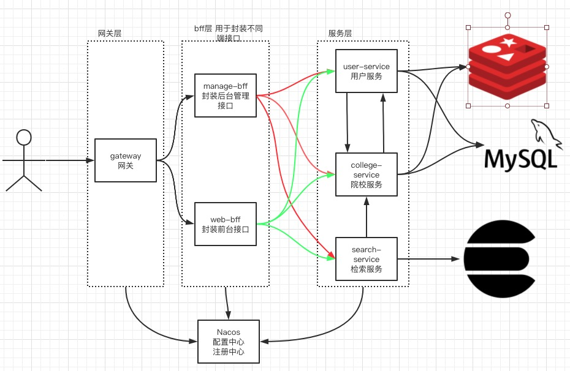

# 院校库项目

## 1 概述
`college`是一个使用`Spring Cloud`和`Spring Cloud Alibaba`搭建的一个院校库项目。

该项目由网关、后台bff、前台bff、院校服务、用户服务五个服务组成。

项目架构图如下：

## 2 技术选型

+ `Spring Boot 2.2.2.RELEASE`
+ `Spring Cloud Hoxton.SR2`
+ `Spring cloud Alibaba 2.2.0.RELEASE`
+ `Spring Cloud Gateway` 实现网关
+ `OpenFeign` 服务间调用
+ `Nacos` 服务注册与发现及配置中心
+ `Sentinel` 服务熔断和降级
+ `Mysql 5.7` 数据库
+ `Redis` 缓存
+ `Elasticsearch` 数据检索